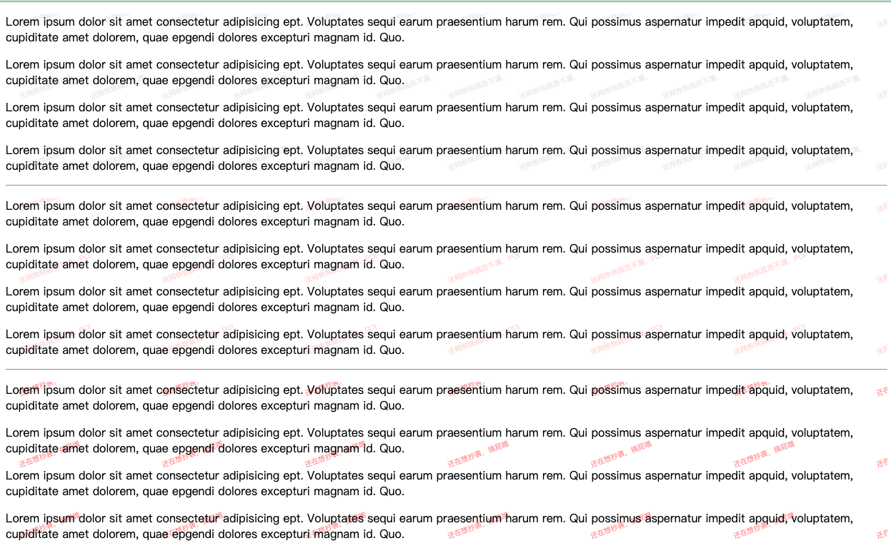
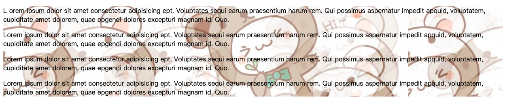

# `@tinyfe/watermark`

> 水印 APIs， 支持自动生成。外部传入水印，并实时监听补全被删除的水印。

## Usage

### 基础用法(so easy)

```js
import WaterMark from '@tinyfe/watermark';

new WaterMark({
  container: document.querySelector('.watermark'),
  text: '法网恢恢疏而不漏，POI',
});
```



### 进阶用法

```js
new WaterMark({
  container: document.querySelector('.watermark'),
  text: '法网恢恢疏而不漏，POI',
  fontType: 'Microsoft YaHei',
  color: 'red',
  fontSize: 24,
  alpha: 0.2,
  image: '',
  repeat: true,
  style: {
    width: 1000,
    height: 800,
    top: '30px',
  },
});

new WaterMark({
  monitor: false,
  container: document.querySelector('.watermark1'),
  text: '还在想抄袭，搞屁哦',
  fontSize: 24,
  color: 'red',
  alpha: 0.5,
  image: '',
  repeat: true,
  style: {
    width: 1000,
    height: 800,
    top: '30px',
  },
});
```

```js
new WaterMark({
  monitor: false,
  image: 'https://avatars.githubusercontent.com/u/20939839?v=4',
  container: document.querySelector('.watermark2'),
  fontSize: 24,
  color: 'red',
  alpha: 0.5,
  style: {
    width: 1000,
    height: 800,
    top: '30px',
  },
});
```



### 参数

#### Options

| Key               | 类型                      | 默认值                              | 描述                                                                                                                                                            |
| ----------------- | ------------------------- | ----------------------------------- | --------------------------------------------------------------------------------------------------------------------------------------------------------------- |
| `container`       | `string` \| `HTMLElement` | `null`                              | 挂载节点。<br /> **注意, 传入值为 `string` 时, 为了保证唯一性, 默认是以 `id` 的方式传入**                                                                       |
| `monitor`         | `boolean`                 | `true`                              | `monitor` 是否监控, `true`: 不可删除水印; `false`: 可删水印                                                                                                     |
| `observer`        | `MutationCallback`        |                                     | `MutationObserver Callback`                                                                                                                                     |
| `observerOptions` | `object`                  | [ObserverOptions](#ObserverOptions) | `MutationObserver Options`                                                                                                                                      |
| `encoderOptions`  | `number`                  | `0.92`                              | 在指定图片格式为 `image/jpeg` 或 `image/webp`的情况下<br/>可以从 `0` 到 `1` 的区间内选择图片的质量。如果超出取值范围, 将会使用默认值 `0.92`。其他参数会被忽略。 |
| `style`           | `object`                  | `{}`                                | 初始化 `canvas` 样式                                                                                                                                            |

#### 水印配置

| Key        | 类型      | 默认值            | 描述                               |
| ---------- | --------- | ----------------- | ---------------------------------- |
| `prefix`   | `string`  | `''`              | 水印前缀，只在 `text` 模式下使用   |
| `text`     | `string`  | `''`              | 当 `image`为空值时使用 `text` 模式 |
| `font`     | `string`  | `Microsoft YaHei` | 字体相关样式                       |
| `fontSize` | `number`  | 24                |                                    |
| `image`    | `string`  | `''`              | 水印图片                           |
| `color`    | `string`  | `#848FA7`         | 水印颜色                           |
| `alpha`    | `number`  | 0.2               | 水印透明度                         |
| `rotate`   | `number`  | 340               | deg，水印旋转角度，                |
| `scale`    | `number`  | 1                 | 缩放                               |
| `repeat`   | `boolean` | true              | 水印是够在`x`轴 `y` 轴上重复       |
| `rows`     | `number`  | 5                 | 重复行数                           |
| `cols`     | `number`  | 5                 | 重复列数                           |
| `startX`   | `number`  | 20                | `px`, 重复水印`x`轴起点            |
| `startY`   | `number`  | 20                | `px`, 重复水印`y`轴起点            |
| `xGap`     | `number`  | 200               | `px`, 重复水印`x`轴偏移            |
| `yGap`     | `number`  | 100               | `px`, 重复水印`y`轴偏移            |

#### ObserverOptions

| Key                     | 类型                    | 默认值      | 描述                                                                                                        |
| ----------------------- | ----------------------- | ----------- | ----------------------------------------------------------------------------------------------------------- |
| `childList`             | `boolean`               | `true`      | 观察目标子节点的变化, 是否有添加或者删除                                                                    |
| `attributes`            | `boolean`               | `true`      | 观察属性变动                                                                                                |
| `subtree`               | `boolean`               | `true`      | 观察后代节点                                                                                                |
| `attributeFilter`       | `string[]`, `undefined` | `['style']` | 特性名称数组, 只观察选定的特性                                                                              |
| `characterData`         | `boolean`               |             | 是否观察 `node.data`(文本内容)                                                                              |
| `attributeOldValue`     | `boolean`               |             | 如果为 `true`, 则将特性的旧值和新值都传递给回调(参见下文), 否则只传新值(需要 `attributes` 选项)             |
| `characterDataOldValue` | `boolean`               |             | 如果为 `true`, 则将 `node.data` 的旧值和新值都传递给回调(参见下文), 否则只传新值(需要 `characterData` 选项) |

## APIs 设计

### 自动水印实现

通过创建 `canvas` 绘制水印, 并转换成 `base64`, 然后添加到外部传入的 `dom` 上, 并通过 [MutationObserver](https://developer.mozilla.org/zh-CN/docs/Web/API/MutationObserver) 提供监视用户对 `DOM` 树所做更改的能力来自动补全删除的水印。(Note: [MutationObserver 兼容性](https://caniuse.com/?search=MutationObserver))

### 外部水印

通过外部传入的 `image` 来实现自动补全删除的水印。
